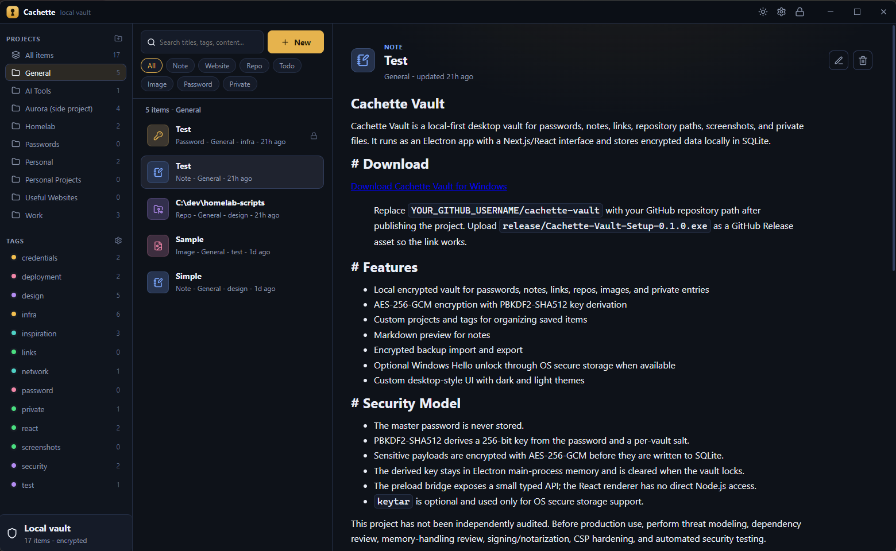

# Cachette Vault

[](https://www.electronjs.org/)
[](https://react.dev/)
[](https://www.typescriptlang.org/)
[](https://github.com/WiseLibs/better-sqlite3)

Cachette Vault is a local-first desktop vault for passwords, notes, todos, links, repository paths, screenshots, and private entries. It runs as an Electron app with a Next.js/React interface and stores encrypted data locally in SQLite.



## Download

[](https://github.com/revz143/cachette-vault/releases/latest/download/Cachette-Vault-Setup-0.2.1.exe)

## Features

- Local encrypted vault for passwords, notes, todos, websites, repos, images, and private entries
- Project folders, tags, search, and item type filters
- Markdown notes with preview plus rich text notes with rendered formatting
- Todo items with editable checklist rows and done state
- Repo entries with local paths, remote URLs, and multiline notes
- Multiline descriptions and notes across item add/edit forms
- Encrypted backup import and export
- One-time recovery keys for resetting a forgotten master password
- Close-to-tray behavior with tray Open, Lock vault, and Exit actions
- Configurable global tray shortcut for opening or hiding the app
- Windows startup and desktop shortcut settings
- Custom desktop-style UI with dark and light themes

## Security Model

- The master password is never stored.
- A random vault key encrypts sensitive payloads with AES-256-GCM before they are written to SQLite.
- PBKDF2-SHA512 derives wrapping keys from the master password and each recovery key.
- Only encrypted vault-key wrappers, salts, and verifier metadata are stored; raw recovery keys are shown once.
- A used recovery key is rotated and cannot be reused.
- The vault key stays in Electron main-process memory and is cleared when the vault locks or the app exits.
- The preload bridge exposes a small typed API; the React renderer has no direct Node.js access.

This project has not been independently audited. Before production use, perform threat modeling, dependency review, memory-handling review, signing/notarization, CSP hardening, and automated security testing.

## Desktop Behavior

- Closing the window hides Cachette to the system tray.
- Use the tray icon or tray menu to reopen the app.
- Use `Exit` from the tray menu to fully quit the app.
- The tray shortcut defaults to `Ctrl + Shift + L` and can be changed or cleared in Settings.

## Development

```bash
npm install
npm run dev
```

The development script starts the Next.js renderer, builds the Electron main/preload files in watch mode, and launches Electron against the local renderer URL.

## Build

```bash
npm run build
npm run dist
```

The Windows installer is written to:

```txt
release/Cachette-Vault-Setup-0.2.1.exe
```

## Project Structure

```txt
src/
  app/                 Next.js App Router entry and global styles
  components/          React vault UI, detail panes, editors, and modals
  data/schema.sql      SQLite schema reference
  electron/            Electron main process, preload bridge, database, crypto, backups
  shared/              Shared item and API types
assets/                Application icons and packaged assets
docs/                  README screenshots and documentation media
release/               Generated installer output
```

## Useful Scripts

```bash
npm run dev        # Start the desktop app in development
npm run build      # Build renderer and Electron process files
npm run dist       # Build the Windows installer
npm run lint       # Run ESLint
npm run typecheck  # Run TypeScript checks
```

## License

MIT License. See [LICENSE](LICENSE).
